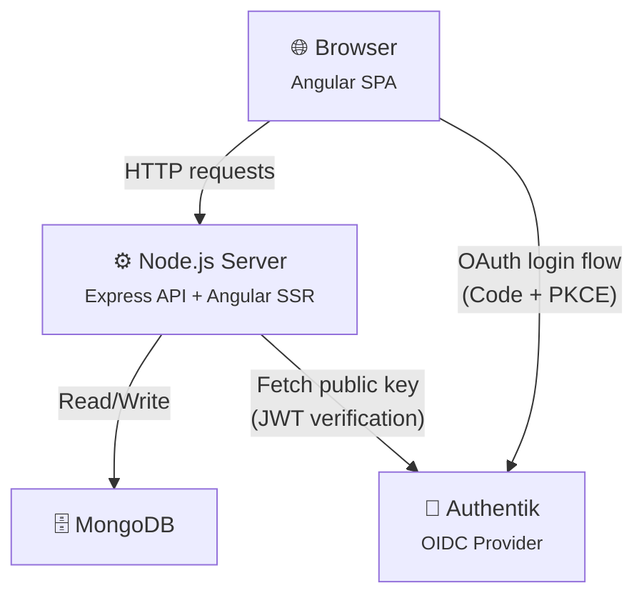
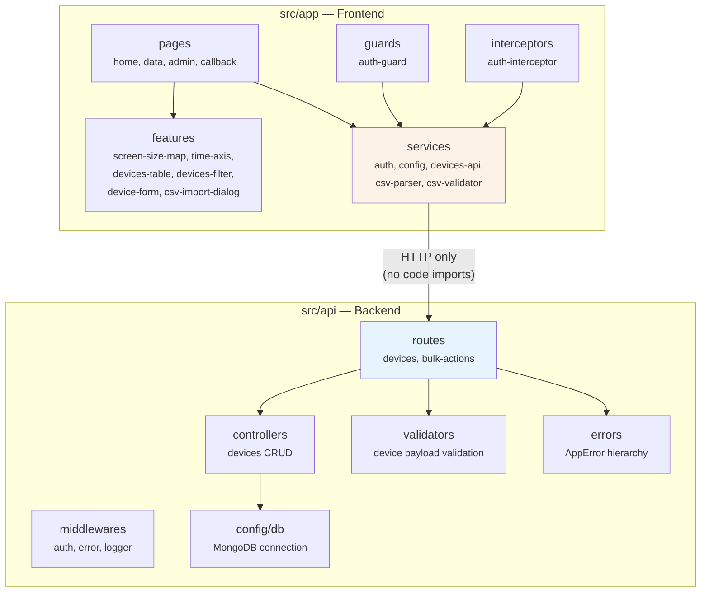
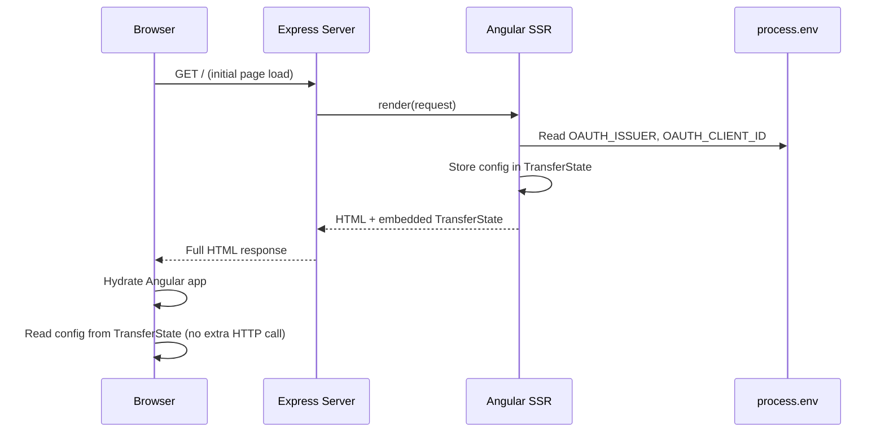
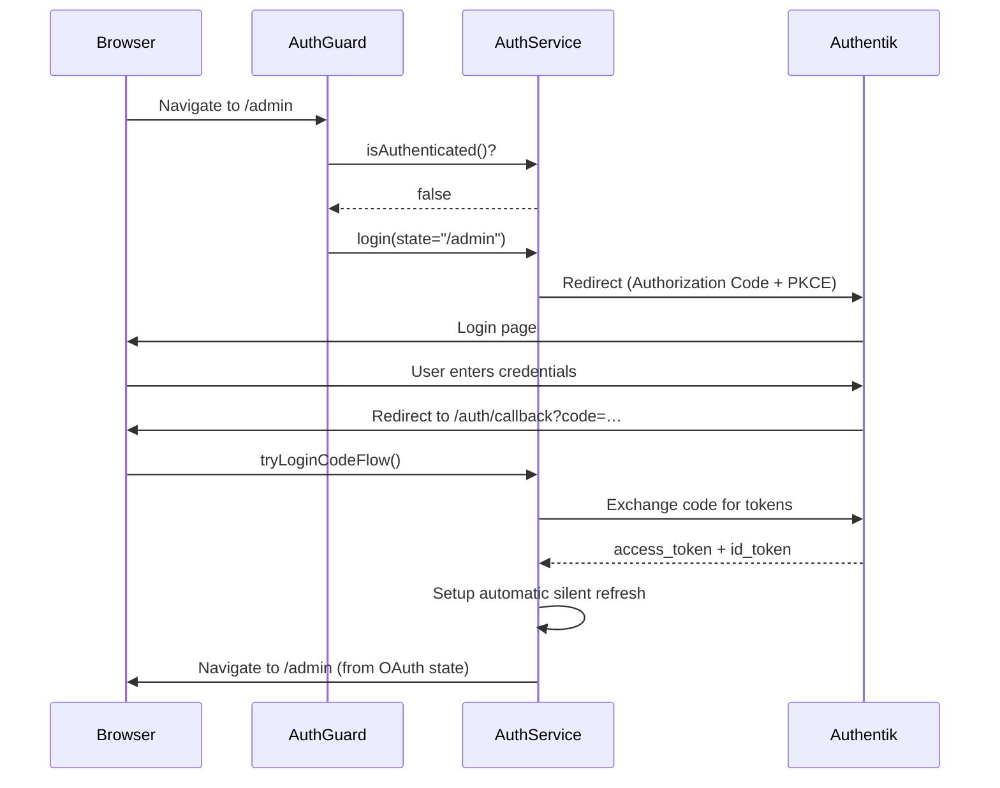
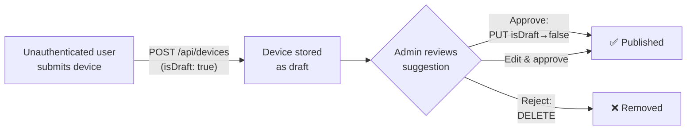
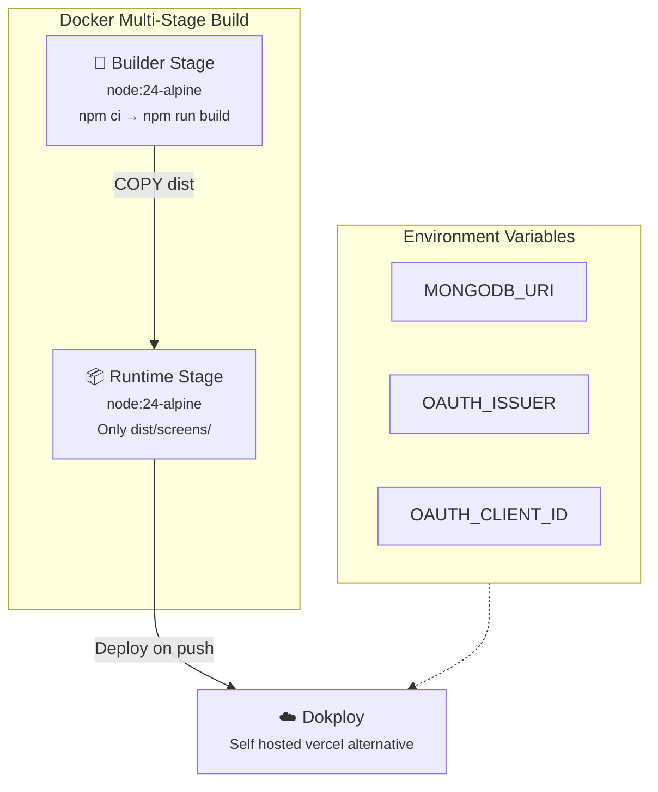
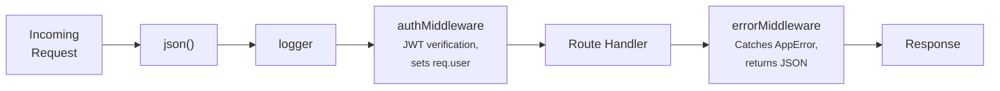
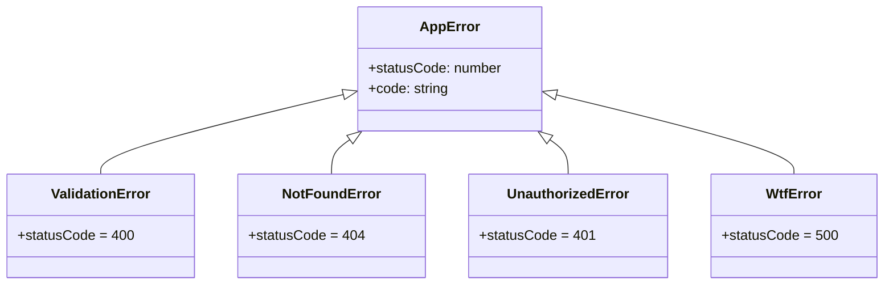

# Architecture documentation

## Solution Strategy

| Decision                          | Choice                                       | Rationale                                                                                                                  |
| --------------------------------- | -------------------------------------------- | -------------------------------------------------------------------------------------------------------------------------- |
| Frontend framework                | Angular 21 with SSR                          | Component model fits the data-driven UI; SSR provides fast initial loads and better SEO for public pages                   |
| Backend                           | Express 5 embedded in the Angular SSR server | Single deployment unit; the API is mounted as Express route before the Angular catch-all handler                           |
| Database                          | MongoDB (native driver)                      | Flexible document model for device data; no ORM overhead                                                                   |
| Authentication                    | Authentik (OIDC) with `angular-oauth2-oidc`  | Self-hosted identity provider; Authorization Code flow with PKCE and refresh tokens                                        |
| Table and range slider components | PrimeNG 21                                   | Implementing these from scratch would be overkill                                                                          |
| Design system                     | CSS custom properties (design tokens)        | Generated via [shaper](https://hihayk.github.io/shaper/); covers typography, spacing, and colors with automatic dark mode  |
| Architecture style                | Monolith with module boundaries              | `src/api/` (backend) and `src/app/` (frontend) are co-located but share zero code imports — they only communicate via HTTP |

## Building Block View

### Level 1 — Container Overview

### Level 2 — Module Decomposition

### API Endpoints

| Method   | Path                               | Auth | Description                                            |
| -------- | ---------------------------------- | :--: | ------------------------------------------------------ |
| `GET`    | `/api/health`                      |  —   | Health check                                           |
| `GET`    | `/api/config`                      |  —   | OAuth config (issuer, clientId)                        |
| `GET`    | `/api/devices`                     | —\*  | List devices (unauthenticated: published only)         |
| `GET`    | `/api/devices/meta`                | —\*  | Metadata (boundaries, counts)                          |
| `GET`    | `/api/devices/:id`                 | —\*  | Single device (unauthenticated: published only)        |
| `POST`   | `/api/devices`                     | —\*  | Create device (unauthenticated can only create drafts) |
| `PUT`    | `/api/devices/:id`                 |  🔒  | Update device                                          |
| `DELETE` | `/api/devices/:id`                 |  🔒  | Delete device                                          |
| `POST`   | `/api/devices/bulk-actions/create` |  🔒  | Bulk create devices                                    |
| `POST`   | `/api/devices/bulk-actions/update` |  🔒  | Bulk update devices                                    |
| `POST`   | `/api/devices/bulk-actions/delete` |  🔒  | Bulk delete devices                                    |

\*Unauthenticated users have restricted visibility (no draft devices).

## Runtime View

### SSR Page Load with TransferState

When `TransferState` is unavailable (e.g. client-only navigation), the browser falls back to `GET /api/config`.

### Authentication Flow

### Suggestion / Draft Workflow

## Deployment

The Dockerfile produces a minimal image: the builder stage installs dependencies and compiles the Angular app (SSR + browser bundles), while the runtime stage copies only the `dist/` output. The final image runs `node dist/server/server.mjs`.

## Cross-cutting Concepts

### Express Middleware Chain

### Error Hierarchy

All API errors extend `AppError`. The centralized `errorMiddleware` catches these and returns a consistent `{ error, code }` JSON response. Unexpected errors return a generic 500.

### AuthService — SSR Compatibility

`AuthService` guards all OAuth operations behind `isPlatformBrowser()`. During SSR, authentication methods are no-ops. To complement this, the server route config uses `RenderMode.Client` for `/admin/**` and `/auth/callback` (where browser-only auth APIs are needed) and `RenderMode.Server` for all public routes.

### Design Tokens

CSS custom properties serve as the design system foundation, generated with [shaper](https://hihayk.github.io/shaper/). Tokens cover three dimensions:

- **Typography**: `--text-xs` through `--text-xl`, base size with increment ratio
- **Spacing**: `--space-s` through `--space-4xl`, derived from a base unit (0.5rem) and increment factor
- **Colors**: HSL-based accent color and 8-level greyscale (`--c-grey1`…`--c-grey8`), with semantic aliases (`--c-background`, `--c-body`, `--c-border`, `--c-error`)

Dark mode is handled entirely by reassigning these variables in a `@media (prefers-color-scheme: dark)` block. PrimeNG is integrated via `cssLayer: 'primeng'` for specificity control, with overrides using the same tokens.

### Signals

The frontend makes extensive use of Angular signals (`signal`, `computed`, `input`, `output`, `toSignal`). Forms use the new `@angular/forms/signals` API with `form()`, `FormField`, and signal-based validators.

## Architecture Decisions

### Monolith with Module Boundaries

The backend (`src/api/`) and frontend (`src/app/`) live in the same repository and are compiled together, but `src/api/` has **zero imports from `src/app/`**. Communication happens only via HTTP. This keeps the option to split them into separate services later while benefiting from simpler deployment now.

### Embedded Express in Angular SSR

Instead of running a separate backend, the Express API is mounted at `/api` before the Angular SSR catch-all in `server.ts`. This means a single `node` process serves both the API and the rendered pages.

### Authorization Code Flow with PKCE

The frontend uses the OAuth Authorization Code flow. PKCE (Proof Key for Code Exchange) is used to prevent authorization code interception — particularly important since this is treated as a browser-based public client with no client secret.

Yes, the SSR backend is theoretically an oauth client that could hold a secret, but to keep things nice and separated, we preferably do nothing auth related with SSR. Code flow + PKCE allows for a cleaner separation of concerns.

### Separate Test Runners

Vitest mocks (`vi.mock`) do not work correctly when the test files are built (using `@angular/build:unit-test`) before being run. The solution: **two separate test pipelines**:

- `ng test` — Angular's built-in test runner (which uses vite) for frontend `.spec.ts` files (excludes `src/api/**`)
- `vitest run` — Vitest for backend API tests only (`src/api/**/*.spec.ts`)

The `npm test` script chains both: `ng test --configuration=ci && vitest run`.

The `test:frontend` or `test:backend` npm scripts are provided for separate watching modes.

### TransferState for Config

Instead of every browser client fetching `/api/config` on startup, the SSR pass reads environment variables and embeds them in Angular's `TransferState`. The browser extracts the config from the serialized HTML — zero extra HTTP requests on initial load.

# Conclusion

# Work journal

| Date       |  Hours | Activities                                                                                                                                                                                                                                                             |
| ---------- | -----: | ---------------------------------------------------------------------------------------------------------------------------------------------------------------------------------------------------------------------------------------------------------------------- |
| 2026-02-03 |      3 | Wrote project requirements and documented architecture choices. Initialized Angular repository.                                                                                                                                                                        |
| 2026-02-04 |      7 | Created basic page structure and devices table component. Added table to admin page. Fixed SSR hydration mismatch. Created route guards and basic auth service.                                                                                                        |
| 2026-02-05 |      5 | Added tests for components and auth service. Initialized Express API with devices routes. Added API route tests with custom DB mock injection.                                                                                                                         |
| 2026-02-06 |      2 | Added error class hierarchy (`AppError`, `ValidationError`, `NotFoundError`, `UnauthorizedError`, `WtfError`) for the API.                                                                                                                                             |
| 2026-02-10 |      8 | Integrated OAuth service (Authentik OIDC). Added JWT auth middleware to Express. Created Dockerfile for deployment. Fixed redirect handling and table row styling. Refactored DB mock for tests.                                                                       |
| 2026-02-12 |      6 | Added admin sub-pages (published devices, suggestions). Added `isDraft` filter to API. Created device form dialog. Added logout functionality. Migrated devices table to PrimeNG. Switched routes to lazy loading with `loadComponent`. Updated requirements document. |
| 2026-02-13 |      4 | Removed dedicated login page (using OIDC redirect instead). Added design-token-based styling. Built devices filter component with dropdown selectors and range sliders.                                                                                                |
| 2026-02-15 |      5 | Finalized filter component styling. Added approve/reject feature for device suggestions. Added UI icons. Refactored auth to use refresh tokens instead of silent refresh. Updated API middlewares.                                                                     |
| 2026-02-16 |      1 | Fixed responsive layout issues on admin pages.                                                                                                                                                                                                                         |
| 2026-02-17 |    1.5 | Refactored MongoDB connection module.                                                                                                                                                                                                                                  |
| 2026-02-19 |      3 | Added bulk action UI to frontend (selection, bulk update/delete buttons, API integration). Currently sending multiple requests to existing single endpoints.                                                                                                           |
| 2026-02-23 |    2.5 | Added bulk action API endpoints (POST create, update, delete) with authentication and updated Frontend to use these.                                                                                                                                                   |
| 2026-02-24 |      3 | Added comprehensive request validators for device payloads and query filters. Configured shorter MongoDB connection timeout.                                                                                                                                           |
| 2026-02-28 |      4 | Built CSV import dialog with file parsing (PapaParse), row-level validation, and bulk device creation.                                                                                                                                                                 |
| 2026-03-02 |      1 | Updated sample devices CSV with additional entries.                                                                                                                                                                                                                    |
| 2026-03-03 |      4 | Wrote first architecture documentation section. Fixed width/height field confusion. Moved devices table to dedicated `/data` page. Added screen-size-map and time-axis visualization components (AI-assisted).                                                         |
| 2026-03-05 |      3 | Fixed UI issues in screen-size-map and time-axis components. Added home page intro text. Removed unused device types. Expanded sample device data.                                                                                                                     |
| **Total**  | **63** |                                                                                                                                                                                                                                                                        |
